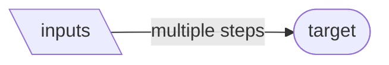
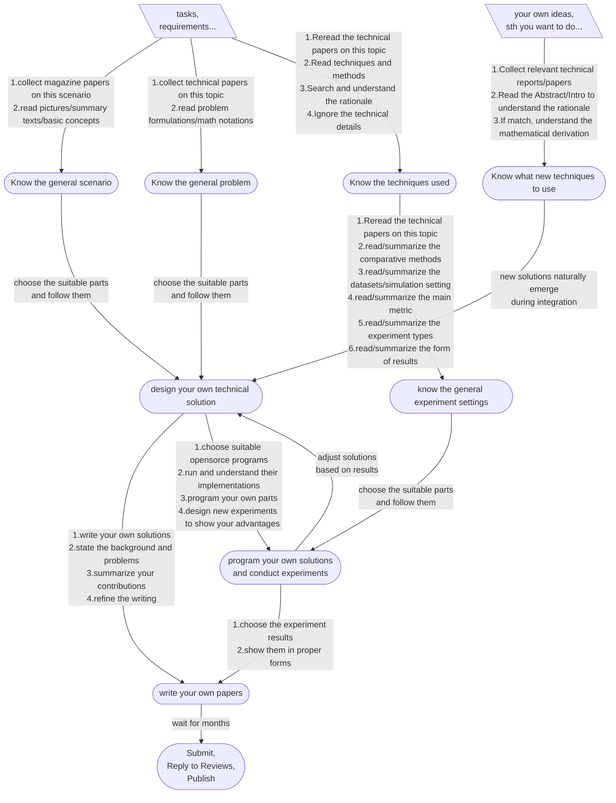

# Research Workflow
This repository presents and organizes workflows for young researchers conducting their studies. 
It includes detailed goals and the steps. 
These ideas come from my reflections as a PhD candidate on how to approach research effectively. 
Fellow researchers are welcome to share their workflows and propose possibilities for 
improving these processes.

## Basic Elements
The complete research process includes:

1. **Restrictive Known Conditions**  
   The tasks or requirements, shown as *prisms*.

2. **Intermediate Targets**  
   The detailed goal or target, shown as a *rounded-corner matrix*.

3. **Multiple Steps**  
   Multiple necessary steps needed to achieve each target, represented by *text on arrows*.

Below is a visual representation of the basic elements:

---
## Technological Innovation Workflow
For junior researchers (e.g., PhD candidates), the research work starts with *some given project requirements* and 
ends with *the publication of a paper*. Innovations and contributions primarily lie in technical solutions.

I reflected on and summarized my own workflow, as shown below. 
When I drew this flow, I noticed that it had an interesting shape: wide in the middle and narrow at both ends.
In fact, this is an underlying aspect of my work: I start with one or two interesting ideas, 
do a lot of research, thinking, designing, experimenting, and finally wrap it up into a complete paper.
The process is long and many of the steps are repeated.
Sometimes it's fun, sometimes it's boring, sometimes it's trouble. 
Yet, I find myself traversing this path over and over.
This repository serves as a space to pause, reflect, and map out what this road truly looks like.

I'm always curious about how others do research and look for possibilities to improve productivity. 
So, welcome to share.

Even with the exact same steps, different researchers will produce completely different results. 
Each step is a different experience for the individual. 
Therefore, the uniqueness of research can be reflected in all aspects of a research work. 
As a young researcher, I think an important lesson is to see yourself at every step.
